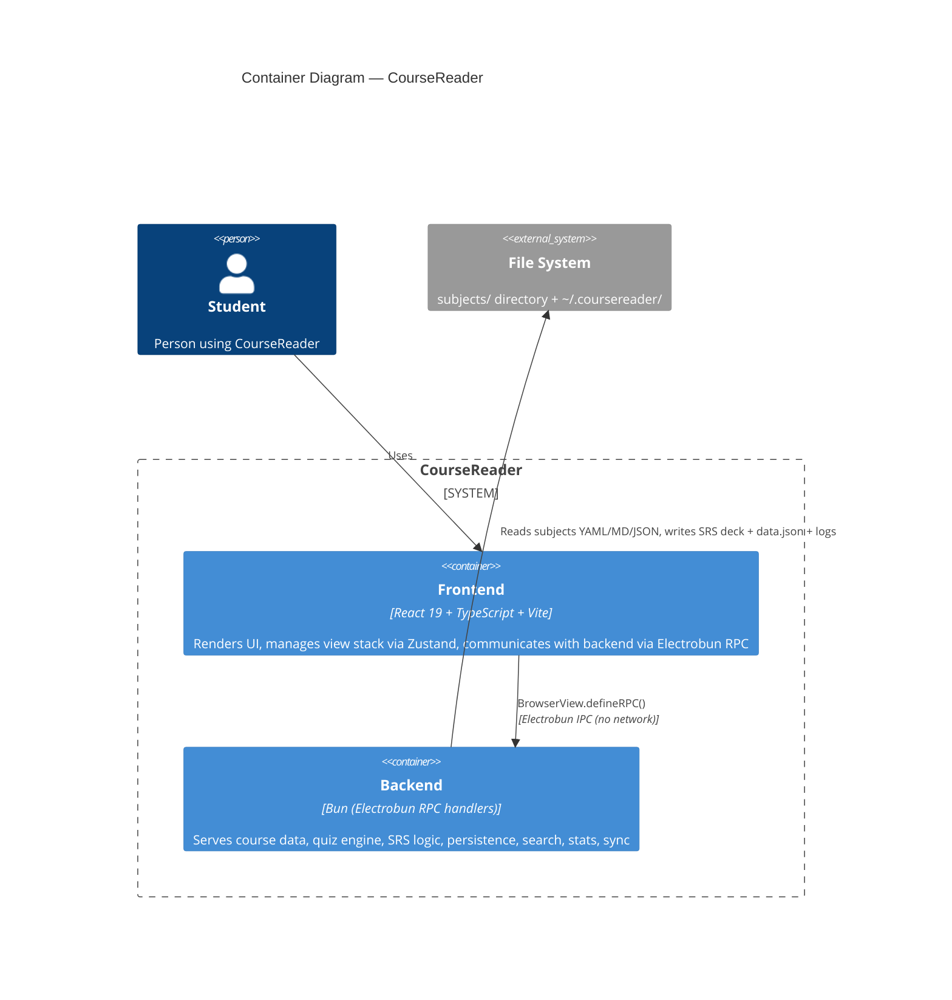

# C4 Container Diagram — CourseReader (Level 2)

## Elements

| Element | Type | Technology | Description |
|---------|------|------------|-------------|
| Frontend | Container | React 19, TypeScript, Vite, Zustand | Renders UI in Electrobun webview. View stack routing, Tailwind CSS, react-markdown |
| Backend | Container | Bun, Electrobun RPC handlers | All API handlers: subjects, lessons, quizzes, SRS, storage, Gemini proxy, search, stats, sync |
| File System | External | Local disk | Course data in `subjects/<id>/`, prefs + annotations in `~/.coursereader/`, logs in `~/.coursereader/logs/` |

## Notes

- Single-process architecture: frontend (Electrobun webview) + backend (Bun RPC handlers in same process).
- Communication via `BrowserView.defineRPC()` — no HTTP server, no open ports. Type-safe RPC via `rpc-schema.ts`.
- All data is local file I/O on backend side. Frontend has no direct file access.
- Only external dependency is Gemini API (optional, only when AI feature used).
