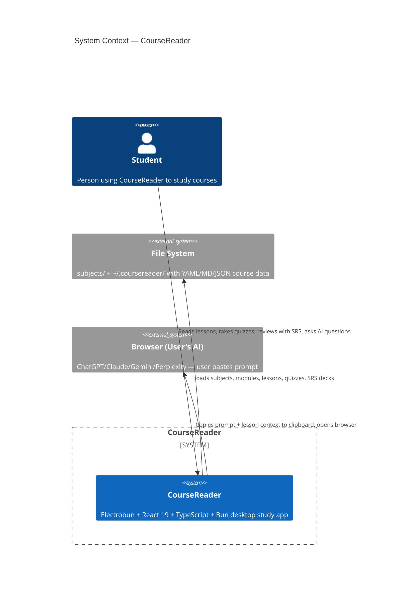

# C4 Context Diagram — CourseReader (Level 1)

## Elements

| Element | Type | Description |
|---------|------|-------------|
| Student | Person | End user who studies course material |
| CourseReader | System | Electrobun desktop app: React 19 + TypeScript frontend, Bun backend |
| File System | External System | `subjects/` directory + `~/.coursereader/` storage |
| Browser (User's AI) | External System | User's browser — paste into ChatGPT/Claude/Gemini/Perplexity |

## Relationships

- Student → CourseReader: reads lessons, takes quizzes, reviews SRS cards, creates flash cards, asks AI
- CourseReader → File System: reads syllabus YAML, lesson MD, quiz YAML, SRS JSON, writes annotations
- CourseReader → Browser: copies persona prompt + lesson context to clipboard, opens Google AI Mode
